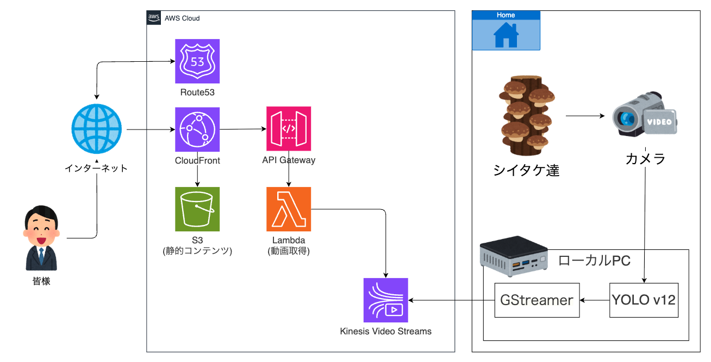

# Shiitake Monitoring System

YOLOv12(カスタムモデル)を使用した、シイタケの成長をモニタリングするためのシステムです。

ローカル環境のカメラで撮影した映像をリアルタイムで物体検出処理し、AWS Kinesis Video Streamsを通じてクラウドに配信します。



### 主な機能

- **リアルタイム検出**: YOLOv12による高精度なしいたけ検出
- **ライブストリーミング**: Kinesis Video Streamsを使用したライブ配信
- **Webインターフェース**: ブラウザでライブ視聴・録画再生

### システム構成

```
ローカルPC（カメラ側）
  ├─ カメラキャプチャした動画をカスタムモデルで検出
  └─ GStreamer経由でKVSに配信

AWS環境
  ├─ Kinesis Video Streams（ストリーミング）
  ├─ CloudFront（配信）
  ├─ S3（静的サイト）
  ├─ API Gateway（エンドポイント）
  └─ Lambda（API処理）
```

## ディレクトリ構成

```
yolo12-shitake/
├── deploy/                      # デプロイ関連
│   ├── local/                  # ローカル環境用ツール
│   ├── terraform/              # バックエンド
│   └── frontend/               # フロントエンド
├── model/                       # YOLOカスタムモデル
├── image/
└── README.md
```

## デプロイ方法

それぞれのディレクトリのREADMEに従ってデプロイしてください。

- **1.バックエンド**: [deploy/terraform/README.md](deploy/terraform/README.md)
- **2.フロントエンド**: [deploy/frontend/README.md](deploy/frontend/README.md)
- **3.ローカル環境**: [deploy/local/README.md](deploy/local/README.md)

## 技術スタック

### ローカル環境（ストリーミング）
- **Python 3.12**: カメラ処理・YOLO実行
- **YOLOv12 (Ultralytics)**: 物体検出
- **OpenCV**: 画像処理
- **GStreamer**: 動画エンコード・ストリーミング
- **Docker**: KVS Producer SDK実行環境

### バックエンド
- **Kinesis Video Streams**: 動画ストリーミング
- **Lambda (Python 3.12)**: APIバックエンド
- **API Gateway**: REST API
- **S3**: 静的ホスティング
- **CloudFront**: CDN
- **Route53**: DNS
- **Terraform**: インフラ管理

### フロントエンド
- **HTML/CSS/JavaScript**: UI
- **HLS.js**: HLSストリーム再生
- **Fetch API**: バックエンド通信
